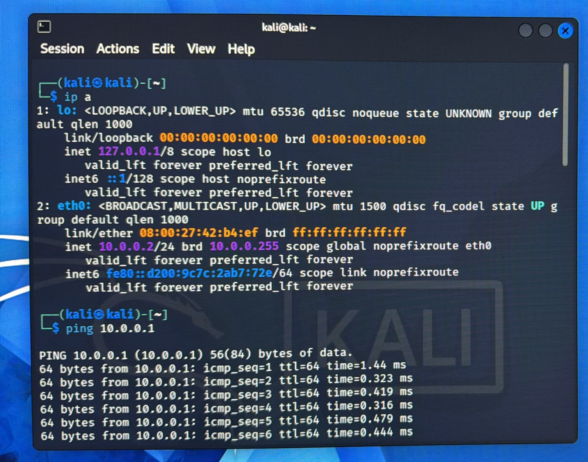

# Networkwalks-B082-Week1-Project-Cybersecurity-Lab-Kali-Linux-Setup
Week 1 Cybersecurity Lab setup using VirtualBox + Kali Linux.

# Project Overview

This project documents my Week 1 cybersecurity lab setup using **VirtualBox** and **Kali Linux**.  
The lab provides a safe sandbox for penetration testing, ethical hacking practice, and network security experiments without risking my host machine or home network

# Step-by-Step Setup
 
1. Installed VirtualBox on my host machine.

2. Created a NATNetwork with IP range `10.0.0.0/24`.
   
 
4. Imported Kali Linux VM into VirtualBox.  
5. Configured the IP settings for Kali Linux.  
6. Verified connectivity with ping tests.  
7. Captured snapshots for rollback and backup.  

# Verification Tests
- `ping 10.0.0.1` → Gateway reachable
- - `ip a` output confirms correct IP assignment 
-  
- `ping <other VM IP>` → VM-to-VM connectivity    
- Internet connectivity check successful 

# Problems Faced & Solutions
- **Issue**: Kali VM had no internet access.  
  **Solution**: Adjusted NATNetwork DHCP settings and restarted VM.  

#  Snapshot & Backup Strategy
- Created snapshots after each major configuration step.  
- Stored backup copies of VM images to external drive.  
- Ensured rollback points for safe experimentation.

#  What I Learned
- How to configure VirtualBox networking.  
- Importance of snapshots for safe rollback.  
- Basics of Kali Linux network troubleshooting.  
- Value of documenting every step for reproducibility.  

#  Tools & References
- [VirtualBox](https://virtualbox.org)  
- [Kali Linux](https://kali.org)  
- [7-Zip](https://7-zip.org)  

# Author
**Kovilen Sk**  
Batch: B082  
LinkedIn: [www.linkedin.com/in/kovilen-sookalingum-500644327 ]  

